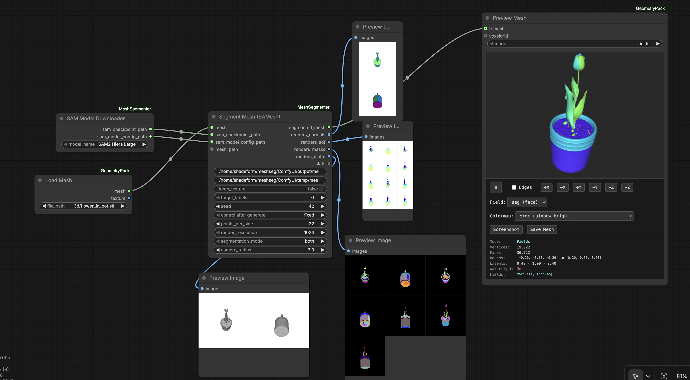
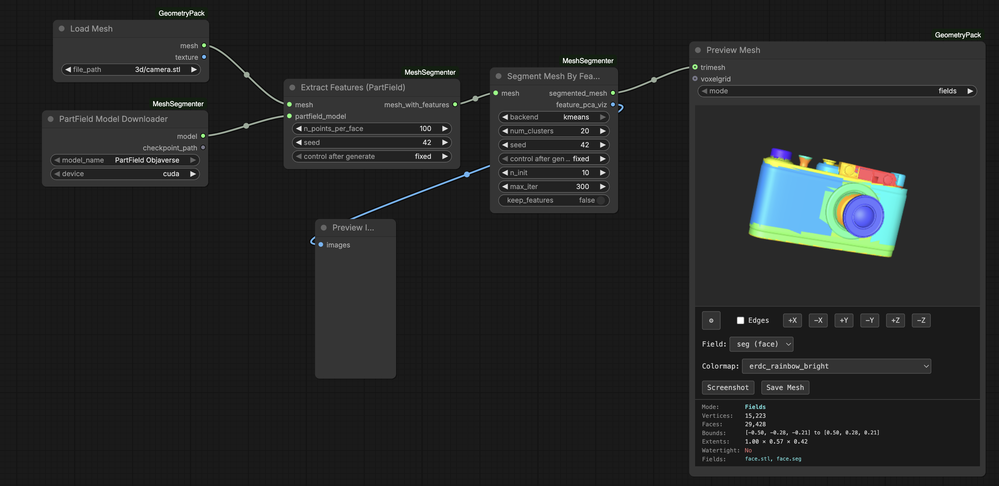

----------
Work in Progress! This node is not finished.
----------

# ComfyUI-MeshSegmenter

Mesh segmentation nodes for ComfyUI using SAMesh and PartField backends. Multiple clustering options available.





https://github.com/user-attachments/assets/47f73c6c-2301-43a2-b09d-96d92308e715

## Installation

Install via ComfyUI Manager or clone into `custom_nodes/`:
```bash
git clone https://github.com/PozzettiAndrea/ComfyUI-MeshSegmenter
```

## Nodes

- **SAMesh** - Segment meshes using SAM2-based multi-view projection
- **PartField** - Segment meshes using 3D feature field learning

## Requirements

- PyTorch 2.0+
- CUDA GPU recommended
- See `requirements.txt` for full dependencies

## Community

Questions or feature requests? Open a [Discussion](https://github.com/PozzettiAndrea/ComfyUI-MeshSegmenter/discussions) on GitHub.

Join the [Comfy3D Discord](https://discord.gg/PN743tE5) for help, updates, and chat about 3D workflows in ComfyUI.

## License

GPL-3.0-or-later
